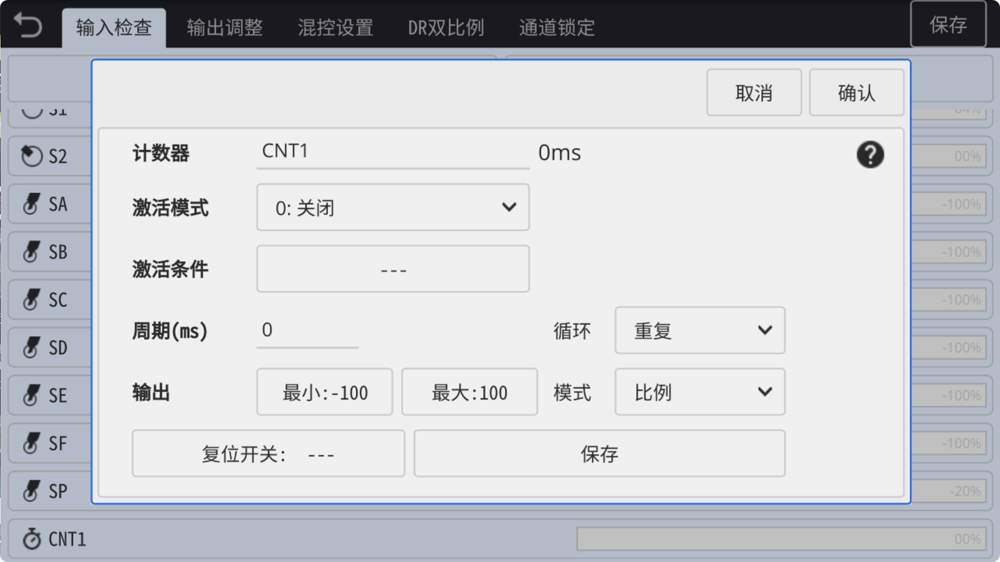

### 定时器(计数器)

　　在**输入检查**页面中可以设置**定时器**(计时器)**CNT1**输入源，以实现自动**开关**或**往复**动作。

**激活模式：**

- **关闭：** 关闭定时器

- **一直开启：** 始终开启定时器

- **开关触发：** 使用开关手动触发或暂停定时器

**激活条件：** 当选择开关触发时，可设置激活条件

　　

**周期：**

- **循环周期：** 当模式为 **比例** 时，以毫秒(ms)为单位，设置定时器周期时间

- **开/关周期：** 当模式为 **开关** 时，以毫秒(ms)为单位，可**单独设置**定时器 **开** 和 **关** 的周期时间

　　

**循环：**

- **一次：** 定时器只运行一次

- **重复：** 定时器以 **0 --> 设置时间** 循环重复

- **往复：** 定时器以 **0 --> 设置时间 --> 0** 循环往复

　　

**输出：** 可自定义输出**最小值**和**最大值**，定时器将以两个设定值进行输出。

　　

**模式：**

- **比例：** 输出值按 **最小 --> 最大** **线性输出**(有中间量)

- 开关：输出值按 **最小 / 最大** **开关输出**(无中间量)
  
  　　

**复位开关：** 可使用一个 **开关** 来复位定时器
