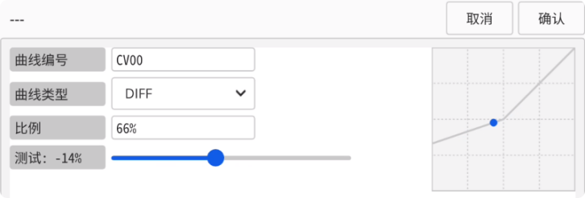
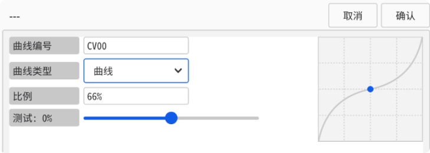
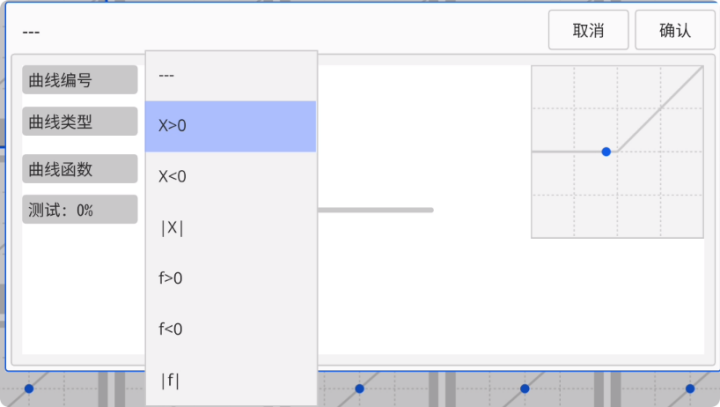
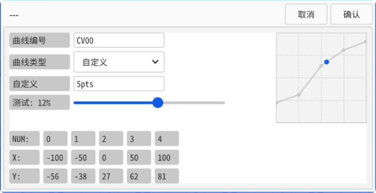

### 曲线设置

　　在输出调整以及混控设置中都可进入**曲线设置页面**，以及在通道中**加载曲线**，逻辑先后顺序是 **混控 > 输出**，例如在混控中添加了一个曲线，在输出中又添加了一个曲线，那么输出中的曲线将会以混控结果为基础叠加曲线效果。

    

    **加载曲线：** 双击曲线即可加载曲线到当前设置条目中。

    **取消加载：** 直接点击左上角返回按钮可取消当前条目上已经加载的曲线。

    **编辑曲线：** 长按曲线图标，或点击齿轮图标可编辑曲线

    

    **曲线类型：**

    

- **DIFF：** 正值（调整中点以下的**最低通道值**），负值（调整中点以上的**最高通道值**）

　　

- **曲线：** **EXPO**曲线，正值（越靠近中点越平滑，越远离中点越**犀利**），负值（越靠近中点越犀利，越远离中点越**平滑**）

　　

- **函数：** 可选一些预设函数曲线（X>0、X<0、|X|、f>0、f<0、|f|）

　　

- **自定义：** 可完全自由的自定义曲线，可选 **3-12** 点曲线，并编辑每个坐标点的 **X/Y** 坐标值，以实现更广泛的功能。

　　
