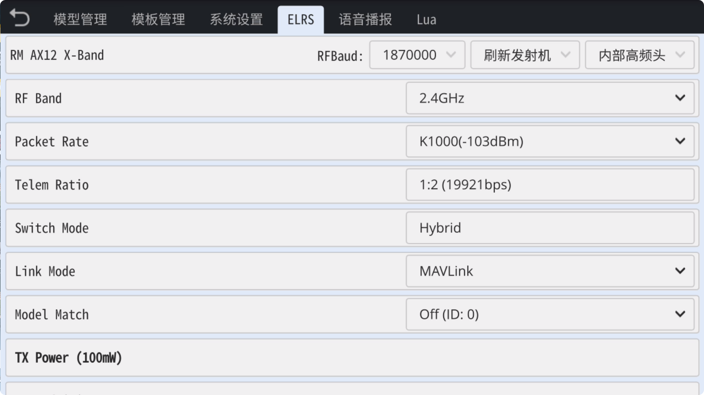
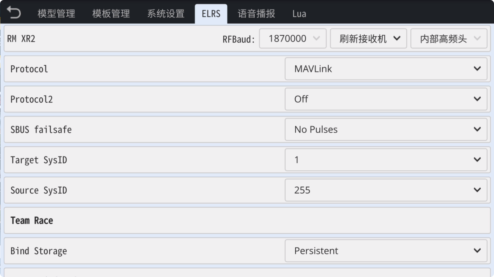
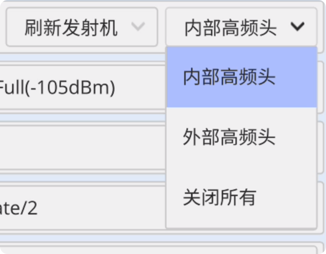
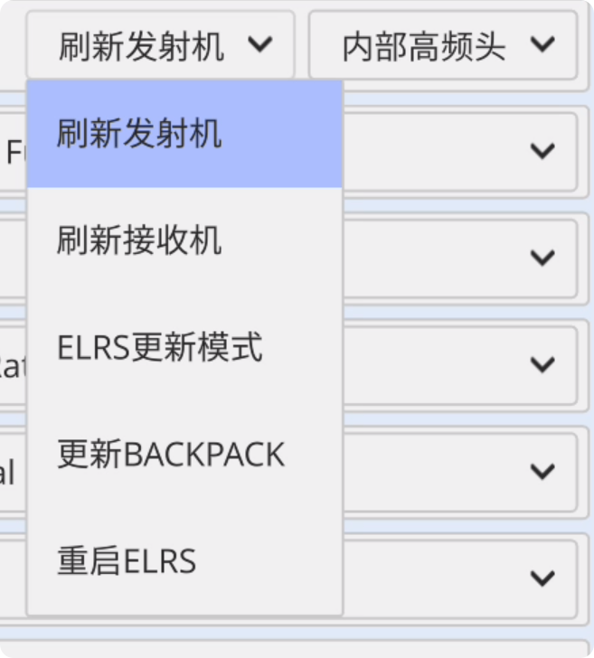
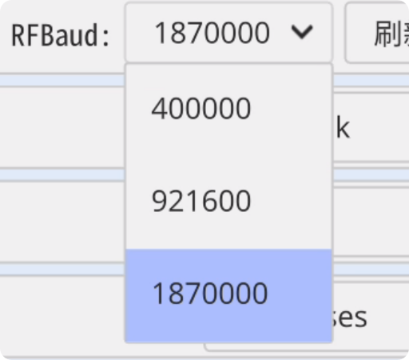

### ELRS

　　ELRS页面可以查看和设置ELRS所有功能，**开启/关闭** ELRS射频模块(高频头)，以及选择 **内置/外置** ELRS模块，并可以通过遥控器顶部USB**更新**内置ELRS射频模块。

　　ELRS(ExpressLRS)为开源射频项目，关于ELRS完整功能介绍请在[ELRS开源项目官网](https://www.expresslrs.org/)查看。

　　**ELRS官网链接：** [**https://www.expresslrs.org/**](https://www.expresslrs.org/)

    

- **查看和更改ELRS发射机选项：** 点击 **刷新发射机** 以查看和更改发射机选项。

　　

- **查看和更改ELRS接收机选项：** 当接收机与发射机连接时，可点击 **刷新接收机** 以查看和更改接收机选项。

　　

- **内部高频头：** 启用内部ELRS高频头（外部高频头自动关闭）

- **外部高频头：** 启用外部ELRS高频头（内部高频头自动关闭）

- **关闭所有：** 内部以及外部高频头同时关闭

　　

- **刷新发射机：** 显示发射机选项，更改发射机选项后，不会自动刷新，需点击 **刷新发射机** 从ELRS高频头读取当前设置项。

- **刷新接收机：** 显示接收机选项，更改接收机选项后，不会自动刷新，需点击 **刷新接收机** 从ELRS接收机读取当前设置项。

- **ELRS更新模式：** 切换到**ELRS主芯片更新模式**，此时可通过**顶部USB端口**更新ELRS主芯片的固件。

- **更新Backpack：** 切换到**Backpack更新模式**，此时可通过**顶部USB端口**更新ELRS Backpack芯片的固件。

- **重启ELRS：** 执行更新固件、WiFi连接以及蓝牙连接后，如需返回正常工作模式，需点击 **重启ELRS** 以重启高频头。

   

- **RF Baud：** 遥控器与发射机的连接**波特率**
  
    **400000：** 只适合ELRS 250Hz以内的**包速率**(Packet rate)
  
    **921600：** 只适合ELRS 500Hz以内的**包速率**(Packet rate)
  
    **1870000：** 适合ELRS K1000(1000Hz)以及所有**包速率**(Packet rate)

   
