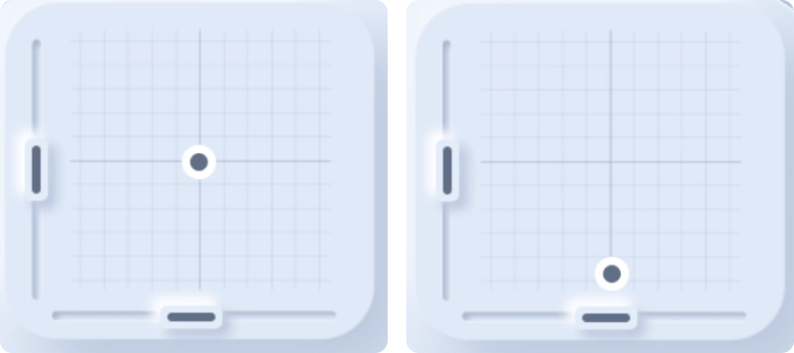

### 主界面

　　系统默认的首页面，首页面包含遥控器基本信息。

　　

**顶栏显示：**

　　

- **信号强度**：遥控器与接收机对频连接后，可以看到信号状态，以及dBm值。

　　

- **设备名称**：中间显示设备名称，可在系统设置中自定义设备名称。

　　

- **飞机端电压**：使用带有电压回传的接收机或带有电压回传的飞行控制器时，可以实时显示飞机端电池电压。

　　

- **遥控器电压**：实时显示遥控器电压

　　

- **日期**：显示当前日期

　　

**主屏幕显示：**

- **摇杆位置**：图形化实时摇杆位置显示，以及微调位置显示

  

- **模型名称及图片**：显示当前模型名称以及图片

  

- **计时器T1/T2**：显示T1/T2计时器时间，点按齿轮图标可进入T1/T2计时器设置。

  　　

- **通道输出**：实时显示CH01-CH08通道输出

 　　

- **开关**：实时显示所有开关位置

 　　

- **旋钮**：实时显示旋钮位置

  　　

- **6段按键**：实时显示6段按键位置

　　

**底栏显示：**

- 系统设置：进入系统设置

- 模型设置：进入模型设置

- 锁定屏幕：锁定屏幕以避免误触

- 主界面：点按返回主界面

- 帮助：在每个页面或功能设置窗口中都有一个帮助图标，点按显示当前功能的说明书

