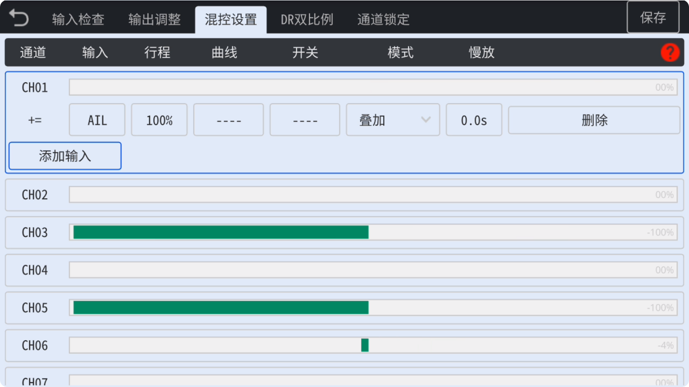
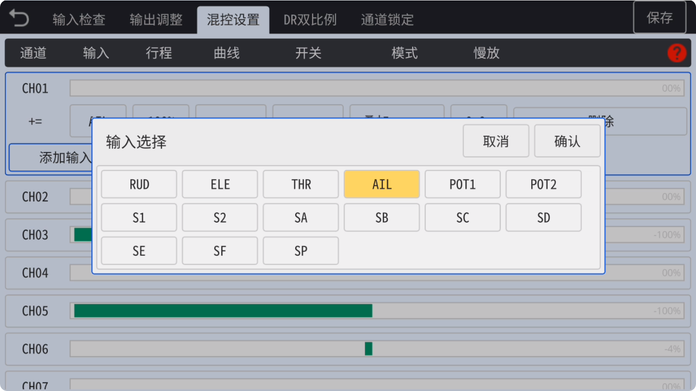
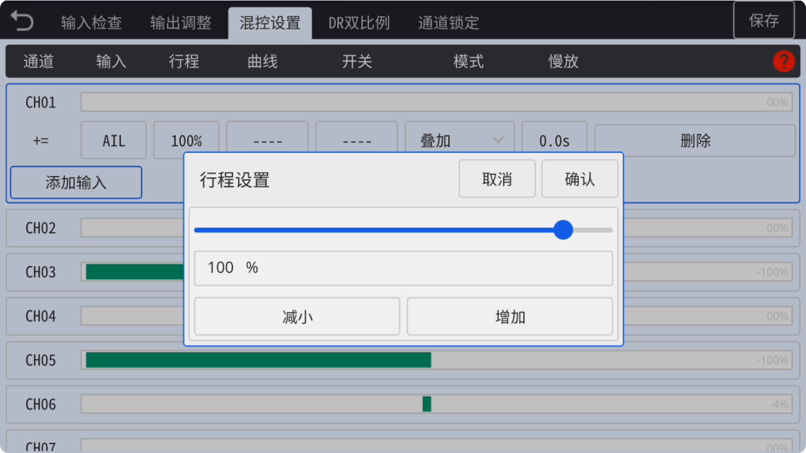
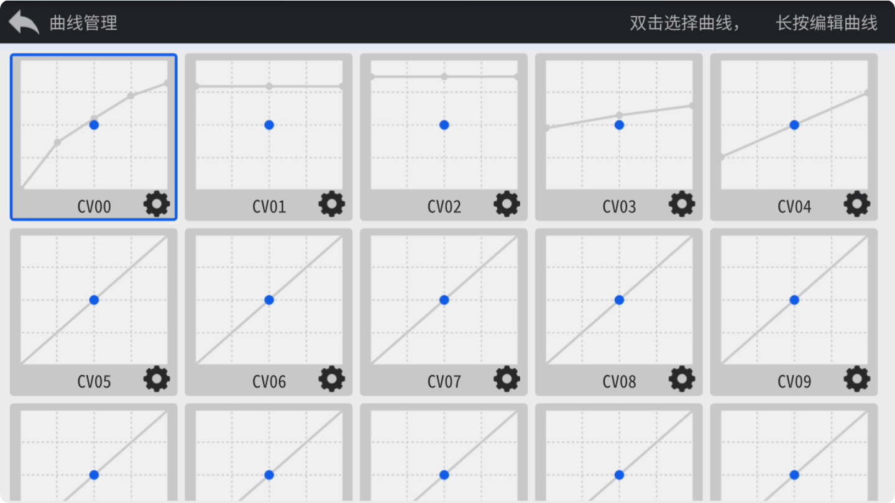
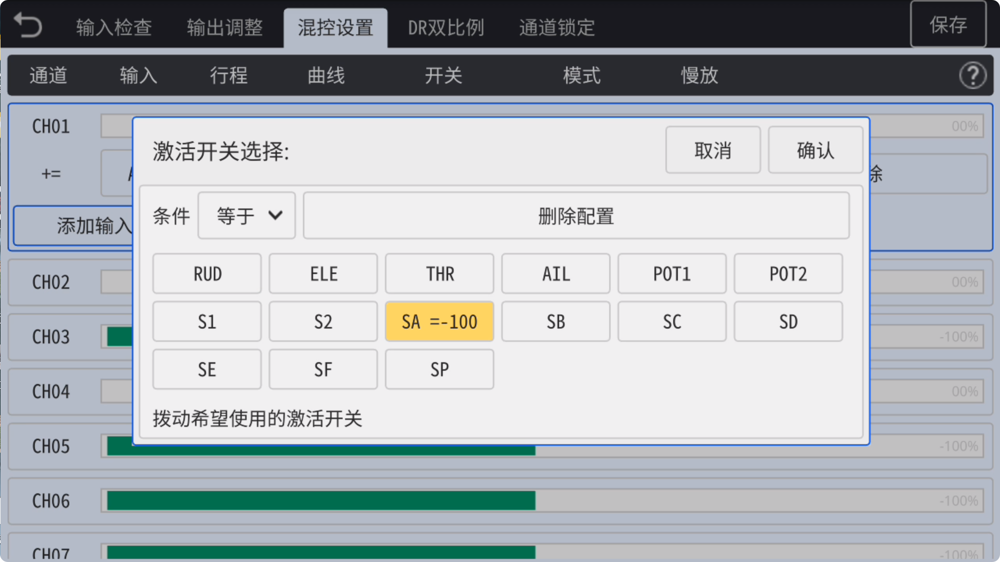
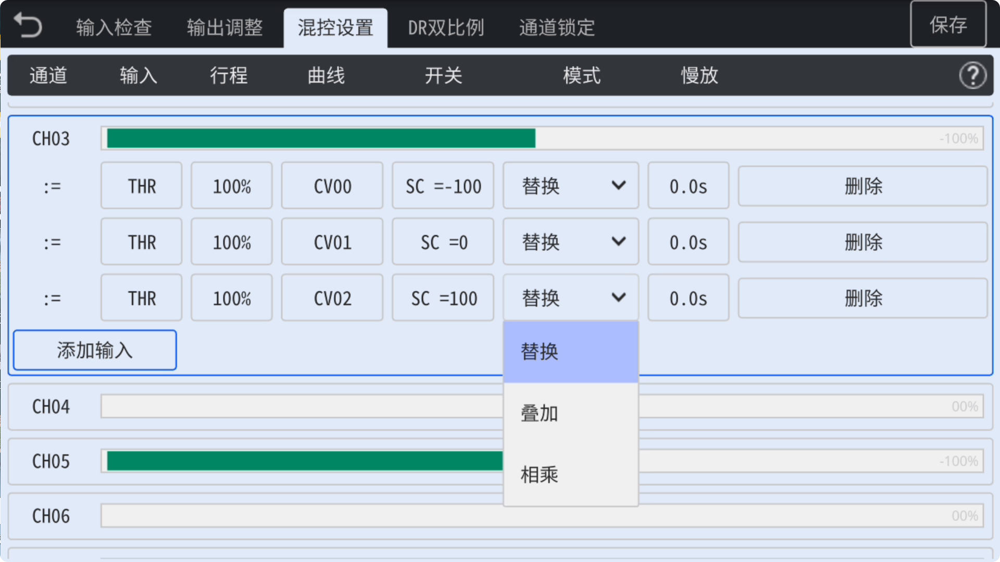
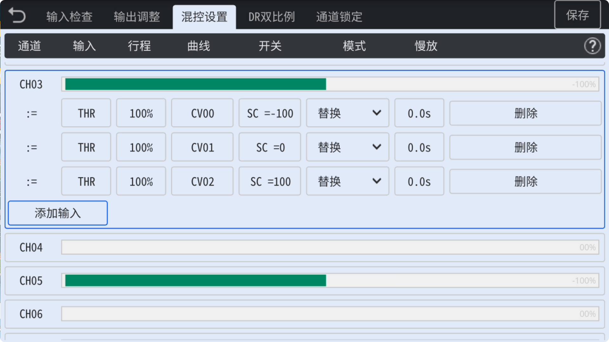
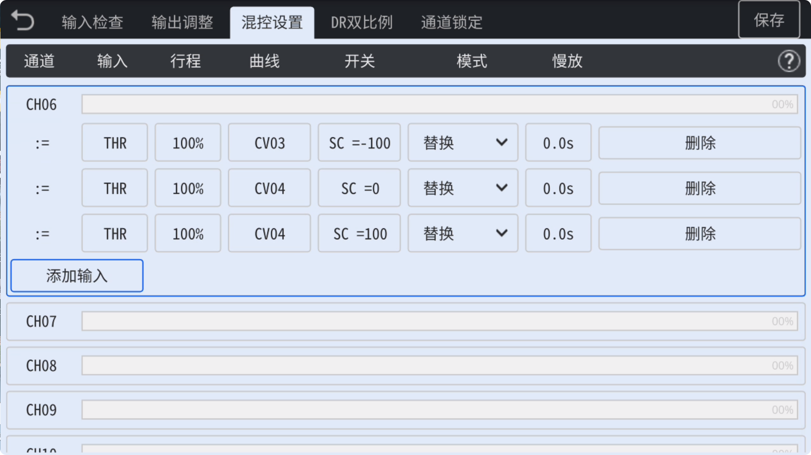
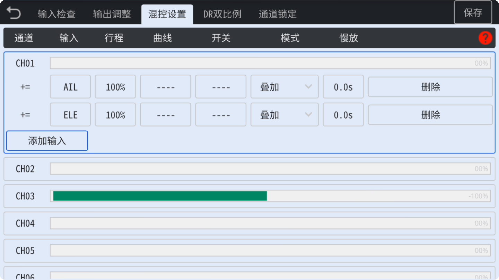
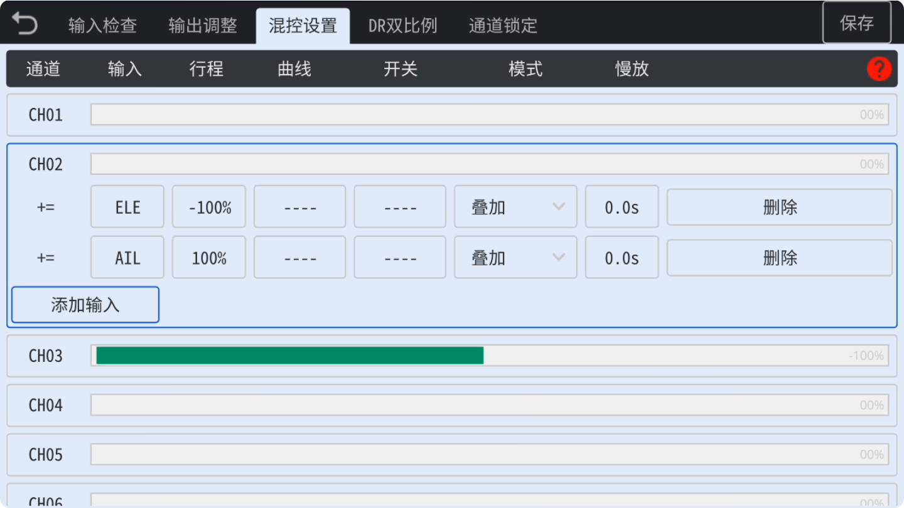

### 混控设置

　　混控设置功能是设置遥控器通道的重要功能，您可以在这里设置每个通道，指定通道的**输入源**（摇杆、旋钮、开关），或调整每条混控的**行程**、**曲线**，以及**激活开关**，以**叠加**、**替换**、**相乘**方式设置混合控制，并可以通过**慢放**功能指定慢动作时间。
　　每个通道都可以设置多个条目并混合控制，通常用于三角翼、V尾、直升机等需要**单个输入控制多个通道**，或**多个输入控制一个通道**的混合控制功能。  

　　**特别注意：**　修改条目某项设置后不会立即反应到输出，请点击右上角的**保存图标**既可以立即应用到输出，既可以在飞机端查看输出效果。  

　　

- **通道**：通道编号，**CH01-CH16**
  
  
  
  　　

- **输入**：选择**输入源**，可选**摇杆**(AIL/ELE/THR/RUD)、**开关**(SA-SF)、**旋钮**(POT1/S2)、以及**6段按键**(SP)。

　　

- **行程**：设置当前条目的通道**行程**（±0-125%），当选择**负值**时，当前条目的输出通道值将**反向**。

　　

- **曲线**：此处可以加载曲线，有**17个自定义曲线**可以使用，在曲线设置中可以选择预设曲线类型（例如**DIFF曲线**、**EXPO曲**线等），可以完全**自定义曲线**，可自由设定**3-12点曲线**，对曲线上每个坐标点位任意设置**X/Y坐标值**。**双击**选择曲线到当前条目，**长按**曲线图标或点击**齿轮图标**可以**编辑**曲线，如果点击返回，将会在当前条目上**解除**加载曲线。
  
  关于曲线功能的详细说明请查看**曲线设置**相关说明。

　　

- **开关**：当前条目的激活**开关档位**，可以**激活/禁用**当前条目。也可以使用其它摇杆或旋钮值做**大于**、**小于**、**等于**等判断并作为**触发条件**。

　　

- **模式**：可选**叠加**、**替换**以及相乘功能，当前条目的行程数值会与之前的数值进行**相关运算**，通常用于**切换**飞行模式等功能时，应选择**替换**模式。

　　

- **慢放**：可设置通道的慢动作效果，最小设置时间单位为0.1秒，最长时间为5.0秒。

- **删除**：删除当前条目。
  
  　
  
  　

**混控实例**：直升机**油门**及**螺距**模式切换

　　

　　此截图内容为直升机的三种**油门模式**，使用**SC开关**的三个档位 **(-100、0、100)** 切换**CH3**上的**正飞航线**、**IDLE1 3D**、**IDLE2** 3D模式，并切换对应**三种模式**的**油门曲线**。

　　

　　此截图内容为直升机的三种**螺距模式**，使用**SC开关**的三个档位 **(-100、0、100)** 切换**CH6**上的**正飞航线**、**IDLE1 3D**、**IDLE2 3D**模式，并切换对应**三种模式**的**螺距曲线**。

　　

**混控实例**：三角翼混控

　　

　　此截图是在**CH01**以及**CH02**同时都引入**AIL**与**ELE**摇杆控制，并使用**叠加**方式，以实现**三角翼**的**横滚**和**升降**混合联动控制功能。

