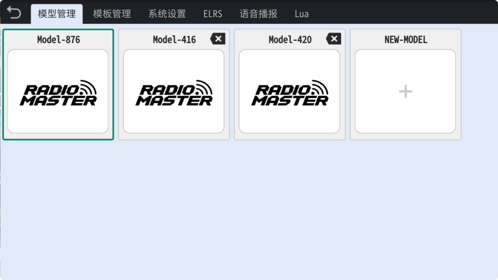
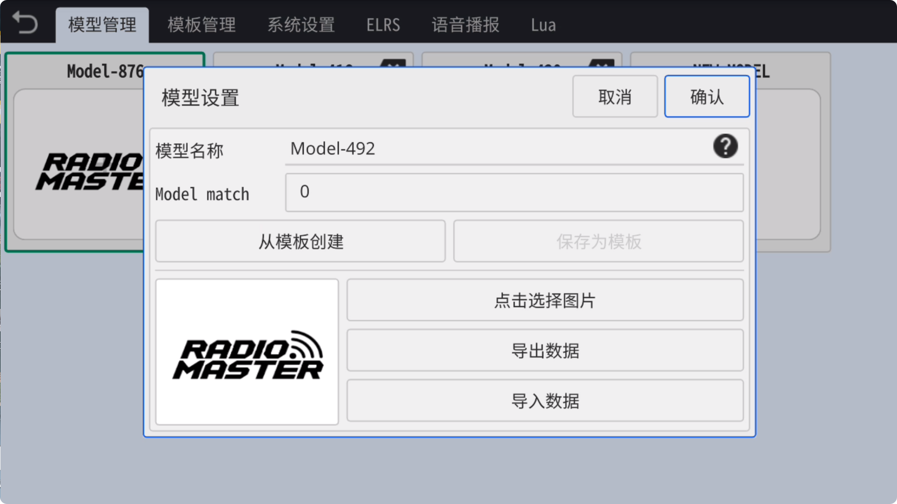

### 模型管理

在模型管理页面中，您可以新建不同类型的模型、为模型命名、指定模型图片、存储当前模型到模板、导出及导入模型数据，以及删除模型等功能。

　　

- **新建模型**：点击空白 **"+"** 号图标，即可弹出新建模型功能

- **模型名称**：为新模型**命名**

- **Model Match：** 设置ELRS的**模型匹配**ID

- **从模板创建**：可以选择自定义模板用于**快速创建**与模板相同的模型

- **保存为模板**：可将当前模型保存为模板，将来可以直接通过此模板**快速创建**同类模型

- **点击选择图片**：可以在默认图形中选择一个图片作为当前模型的图片，也可以在**存储器**中选择任意**自定义图片**作为当前模型图片

- **导出数据**：可以导出当前模型到内置存储**Download文件夹**内，以**分享**或**备份**当前模型

- **导入数据**：可以从存储器**Download文件夹**中**导入**模型

- **删除模型**：当前模型不可删除，未激活的模型点击右上角**删除标记**即可删除此模型
