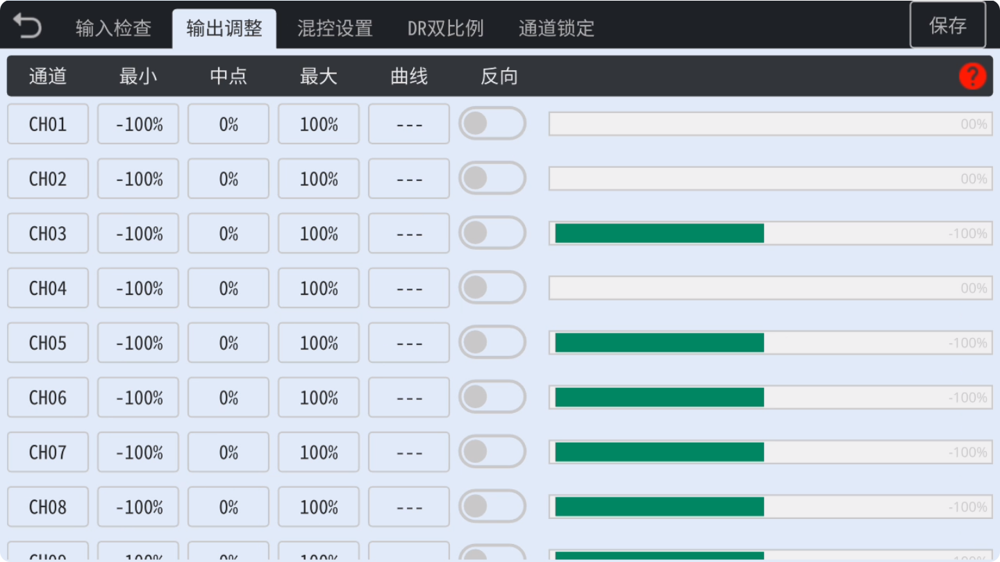

### 输出调整

　　在这里可以**调整**每个通道的**中点偏移**值，以及**最小**和**最大**值，并且可以**加载曲线**，以及**反向**通道。

　　

- **最小/最大值**：可扩展通道到±125%。可以缩小通道以限制舵量。

- **中点**：可更改中点偏移值，不同与临时微调，这里可以设置通道的固定偏移值，以消除手工安装的舵面偏差。

- **曲线**：此处可以**加载曲线**，有**17个自定义曲线**可以使用，在曲线设置中可以选择**预设曲线类型**（例如DIFF曲线、EXPO曲线等），可以完全**自定义曲线**，可自由设定**3-12点**曲线，对曲线上每个**坐标点位**任意设置**X/Y坐标值**。**双击**选择曲线到当前条目，**长按**曲线图标或点击齿轮图标可以**编辑**曲线，如果点击返回，将会在当前条目上**解除**加载曲线。
  关于曲线功能的详细说明请查看**曲线设置**相关说明。

- **反向**：可调整每个通道的**正反方向**。
