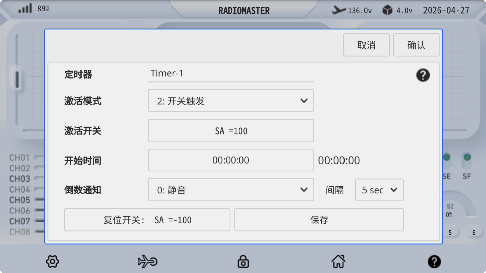
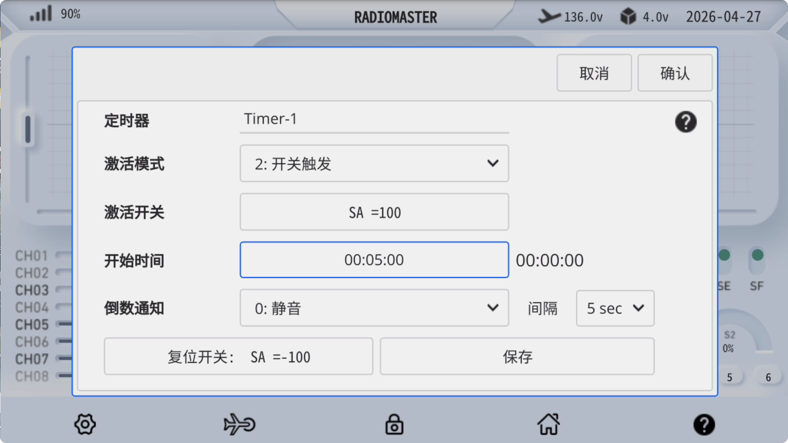

### 计时器

**激活模式：** 

- 关闭：关闭计时器

- 一直开启：始终开启计时器

- 开关触发：设定任意开关位置触发计时器

- 拉低油门：油门到达最低点时触发计时 器

- 油门中位%：油门到达中位时触发计时器

抬起油门：油门高于最低位时触发计时器

**激活开关：** 设置定时器激活开关，例如 **SA↑**

**开始时间：** 当开始时间为 **00:00:00** 时，为**正计时**功能。当设置任意时间后，将以此时间开启**倒计时**。

**倒数通知：** 可选静音、蜂鸣音、语音报时。 

**间隔：** 倒数通知的间隔时间。 

**复位开关：** 设定定时器复位开关，例如 **SA↓**

设置完成后请点击 **保存** 以存储设定，点击 **确认** 关闭设置窗口。

　　

**计时器设置实例：** SA开关 **打开(100)** 时，开始正计时(起始时间为00:00:00)；SA开关 **关闭(-100)** 时，**复位**计时器

　　

**计时器设置实例：** SA开关 **打开(100)** 时，开始5分钟倒计时(起始时间为00:05:00)；SA开关 **关闭(-100)** 时，**复位**计时器

