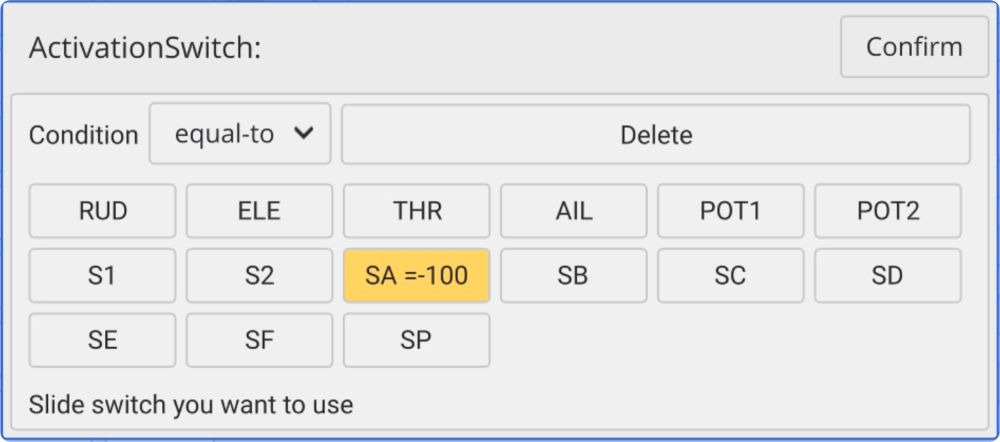
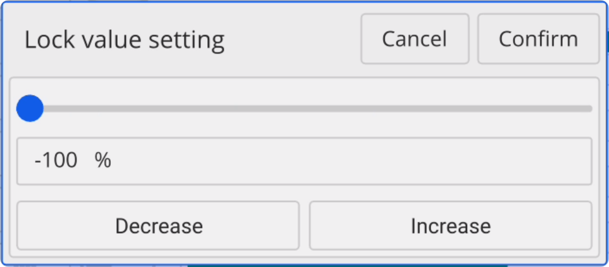
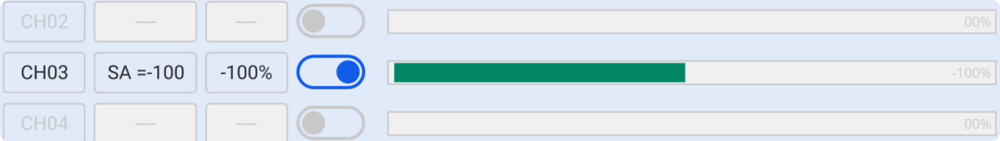

### CHLock

Here, you can set the **Channel Lock** function. For example, by using the **SA switch in the up position**, you can lock the throttle channel at **-100%** to **lock the throttle channel** before or after flight, preventing accidental movement of the throttle stick and avoiding potential hazards.

    

**Setting Example**: **When SA↑**, lock the throttle to **-100%**

