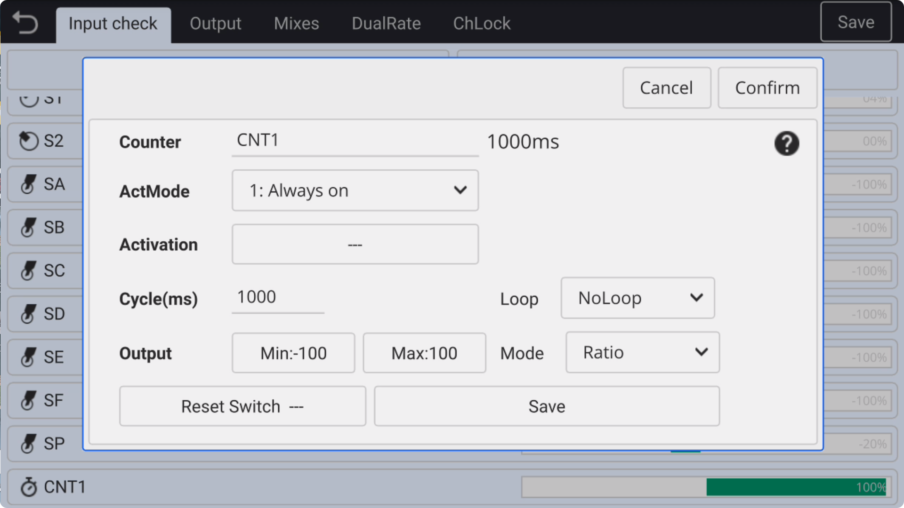

### Counter Timer

On the **Input check** page, you can set the input source of the **Counter timer** **CNT1** to achieve automatic **on/off** or **reciprocating** actions.

**ActMode:**

- **Off:** Close the counting timer.

- **Always On:** Always **turn on** the timer.

- **Switch trigger：** Use the switch to manually **trigger or pause** the counting timer.
  
  　　

**Activation:** When the selection **switch trigger**, the activation condition can be set.

　　

**Cycle:**

- **Cycle Time**: When the mode is **Ratio**, set the timer cycle time in milliseconds (ms).

- **On/Off Cycle:**  When the mode is set to **Switch**, the cycle time for the timer on and off can be individually set in milliseconds (ms).

　　

**Loop:**

- **NoLoop:** The countdown timer runs only once.

- **Repeat:** The timer repeats repeatedly from **0 --> set time**.

- **PingPong:** The timer cycles cyclically as **0 --> Set time --> 0**.

　　

**Output:** Customizable output **Minimum value** and **Maximum value**, the timer will output based on these two set values.

　　

**Mode:**

- **Ratio:** Output values are linearly scaled from **minimum --> maximum** (with intermediate values).

- **Switch:** Output value according to **minimum / maximum** switch output (no intermediate values)
  
  　　

**Reset Switch:** A **Switch** can be used to reset the timer.
