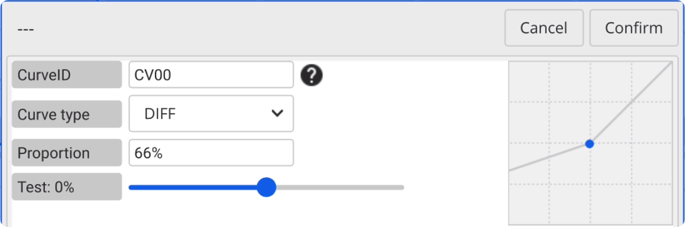
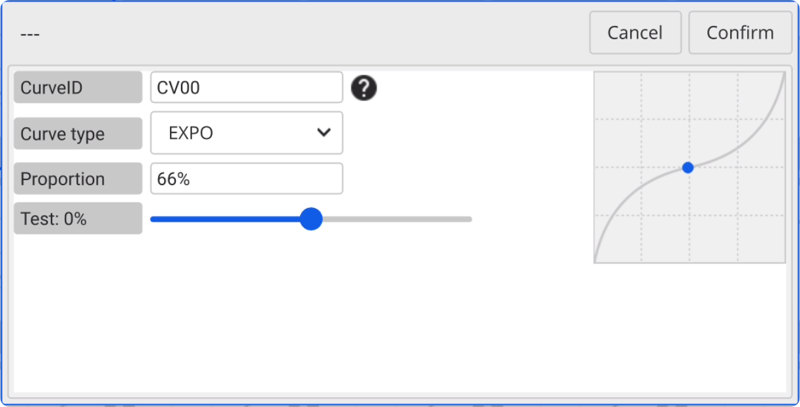
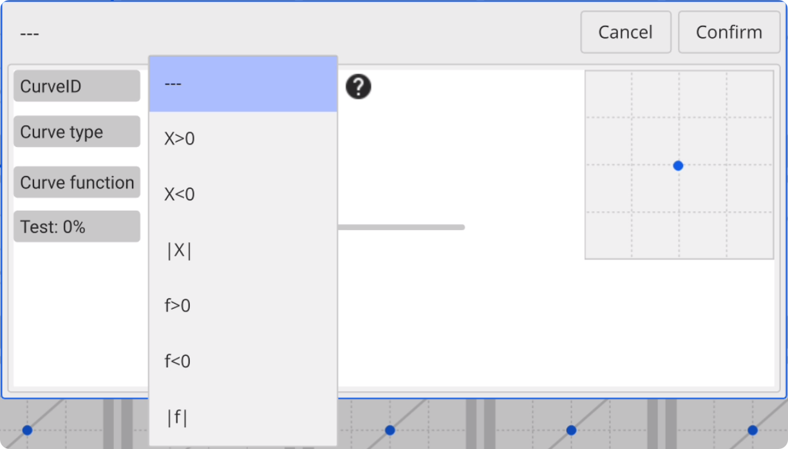
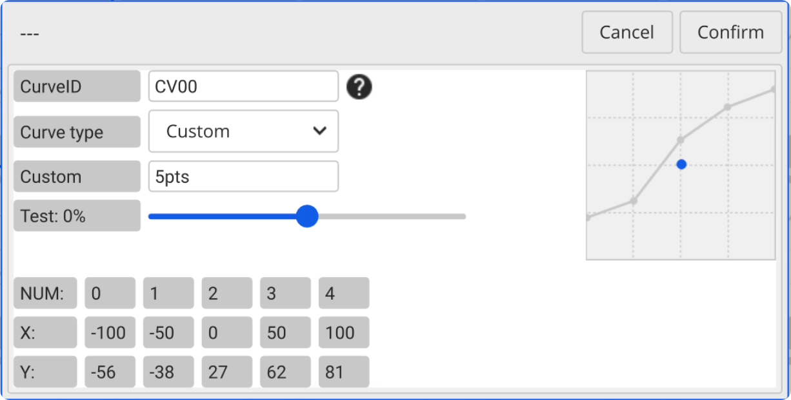

### Curve Settings

In both the output adjustment and mixer settings, you can access the **Curve Settings Page** and **load curves** in the channels. The logical sequence is **Mixer > Output**. For example, if a curve is added in the mixer and another curve is added in the output, the curve in the output will be applied on top of the mixer result.  

　

**Loading a Curve:** Double-click the curve to load it into the current setting entry.

**Canceling Loading:** Simply click the back button in the upper-left corner to remove the curve loaded on the current entry.

**Editing a Curve:** Long-press the curve icon or click the gear icon to edit the curve.

    

    **Curve type：**

    

- **DIFF:** Positive values (adjust the **minimum channel value** below the midpoint), negative values (adjust the **maximum channel value** above the midpoint)

　　

- **EXPO:** positive values (**smoother** near the midpoint, **sharper** farther away from the midpoint), negative values (**sharper** near the midpoint, **smoother** farther away from the midpoint).

　　

- **Function:** Optional preset function curves (X>0, X<0, |X|, f>0, f<0, |f|)

　　

- **Custom:** Fully customizable curves with options for **3-12** control points, allowing editing of **X/Y** coordinate values for each point to achieve broader functionality.

　　
