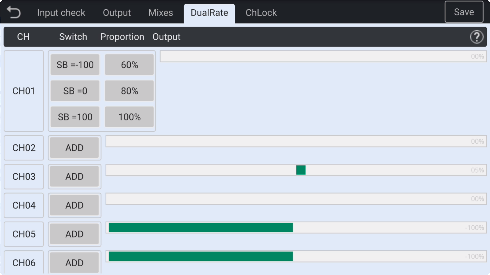
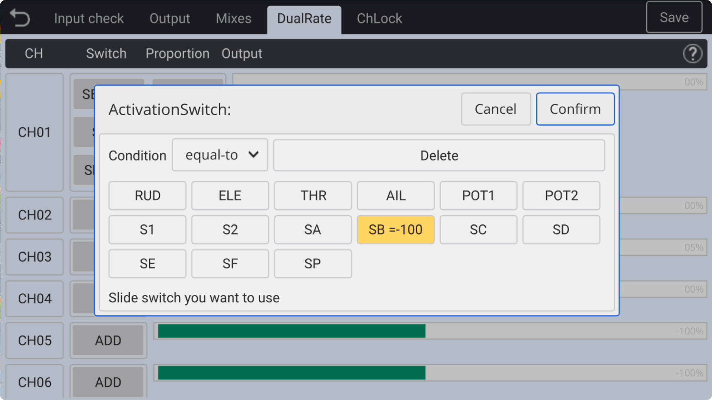
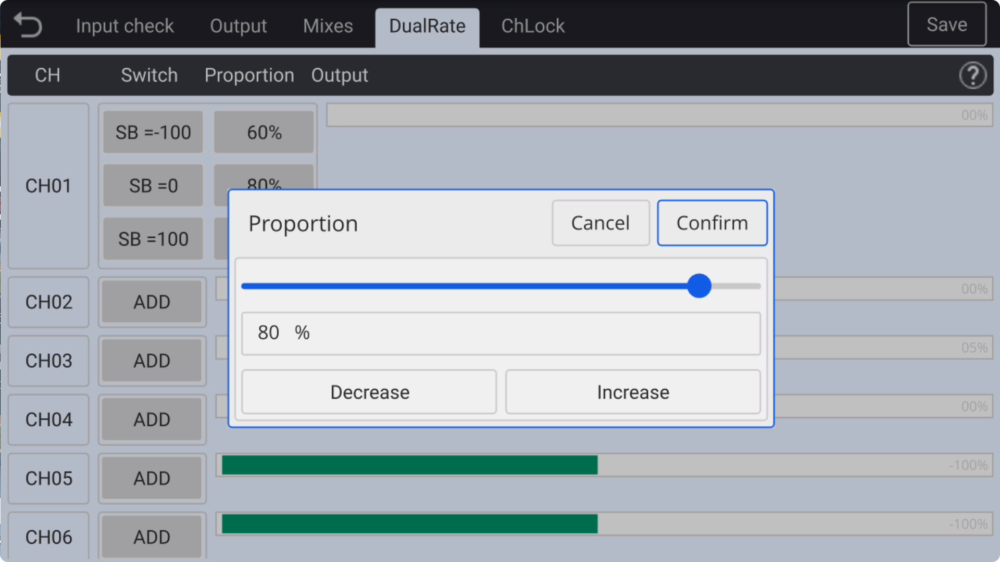

### Dual Rate

Here, various proportional controls for each channel can be set. The following demonstrates how the **SA** switch, in its **up(-100), middle(0), and down(100)** positions, controls the channel's output values of **60%, 80%, and 100%**, respectively, to achieve **different control throws** during flight.

　　

**D/R Dual Rate** switch selection interface and channel volume setting interface: 

