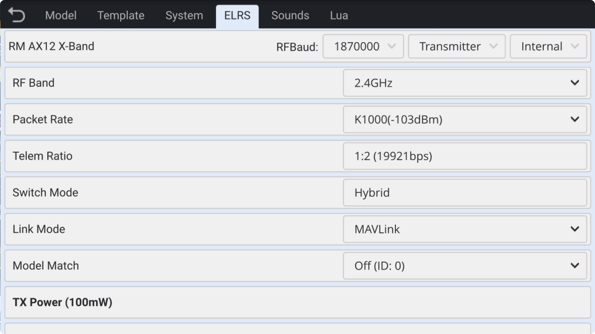
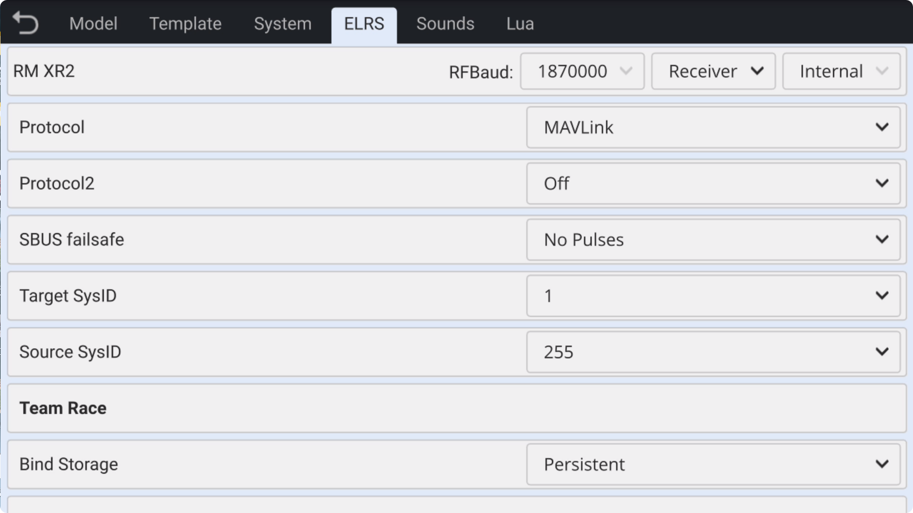
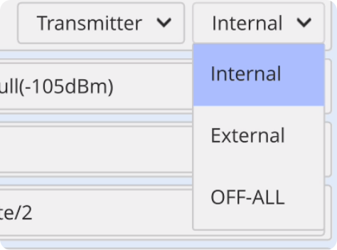
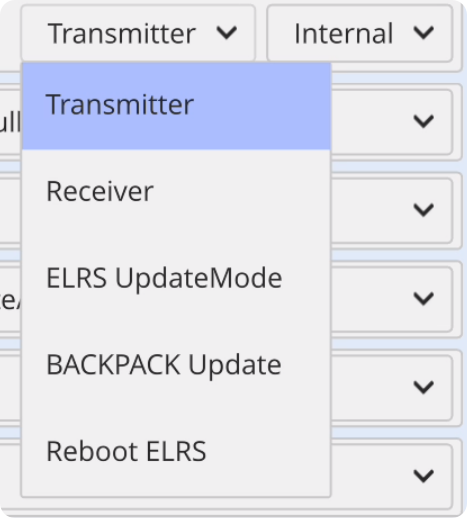
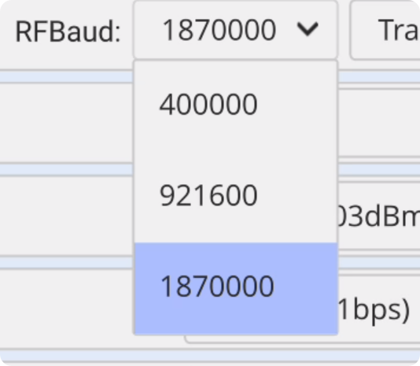

### ELRS

The ELRS page allows you to view and configure all ELRS functions, **turn on/off** the ELRS RF module (transmitter), and select the **internal/external** ELRS module. You can also **update** the internal ELRS RF module via the USB port on the top of the transmitter.

ELRS (ExpressLRS) is an open-source RF project. For a complete introduction to ELRS features, please visit the [ELRS open-source project official website](https://www.expresslrs.org/).

**ELRS official website link:** [**https://www.expresslrs.org/**](https://www.expresslrs.org/)

    

- **View and Change ELRS Transmitter Options:** Click **Transmitter** to read and refresh transmitter options, and view or modify the transmitter settings.

　　

- **View and Change ELRS Receiver Options:** When the receiver is connected to the transmitter, click **Receiver** to read and refresh receiver settings, as well as view and modify receiver options.

　　

- **Internal:** Enable the internal ELRS module (external module automatically turns off)

- **External:** Enable the external ELRS module (internal module automatically turns off)

- **OFF-ALL:** Both internal and external modules are turned off simultaneously

　　

- **Transmitter:** Displays transmitter options. After modifying transmitter settings, changes will not refresh automatically. You need to click **Refresh Transmitter** to read the current settings from the ELRS module.

- **Receiver:** Displays receiver options. After modifying receiver settings, changes will not refresh automatically. You need to click **Refresh Receiver** to read the current settings from the ELRS receiver.

- **ELRS Update Mode:** Switches to **ELRS Main Chip Update Mode**, allowing firmware updates for the ELRS main chip via the **top USB port**.

- **Backpack Update:** Switches to **Backpack Update Mode**, enabling firmware updates for the ELRS Backpack chip via the **top USB port**. Note that when updating the Backpack, the **Link Mode** in the transmitter must be set to **Mavlink**. After the update, you can choose either Normal or Mavlink as needed.

- **Reboot ELRS:** After performing firmware updates, WiFi connections, or Bluetooth connections, if you need to return to normal operation mode, click **Reboot ELRS** to restart the module.

 　　

- **RF Baud:** The **baud rate** for the connection between the remote control and the transmitter.

　　　**400000:** It is only suitable for **packet rates** within ELRS **250Hz**.

　　　**921600:** Only suitable for **packet rates** within ELRS **500Hz**.

　　　**1870000:** Suitable for ELRS **K1000 (1000Hz)** and **all packet rates**.

 
