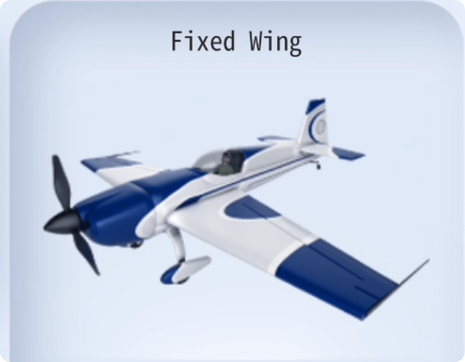

### MainView

The default home page of the system, which includes basic information about the remote control.

　　

**Top Bar:**

　　

- **Signal Strength**: After the remote control and receiver are paired and connected, the signal status and dBm value can be viewed.

　　

- **Device Name**: The device name is displayed in the center and can be customized in the system settings.

　　

- **Aircraft Voltage**: When using a receiver with voltage telemetry or a flight controller with voltage telemetry, the battery voltage of the aircraft can be displayed in real time.

　　

- **Remote Control Voltage**: Displays the remote control voltage in real time.

　　

- **Date**: Displays the current date.

　　

**Home screen display:**

- **Joystick Position**: Graphical real-time display of joystick position, along with fine-tuning position display.

  

- **Model Name and Image**: Displays the current model name and image.

  

- **Timers T1/T2**: Displays T1/T2 timer durations. Tap the gear icon to access T1/T2 timer settings.

  　　

- **Channel Output**: Real-time display of CH01-CH08 channel outputs.

 　　

- **Switches**: Real-time display of all switch positions.

 　　

- **Knobs**: Real-time display of knob positions.

  　　

- **6-Position Switch**: Real-time display of the 6-position switch location.

　　

****Bottom Bar:****

- **System Settings:** Enter system settings

- **Model Settings:** Enter model settings

- **Lock Screen:** Lock the screen to prevent accidental touches

- **Home Screen:** Tap to return to the home screen

- **Help:** There is a help icon on every page or in each function settings window. Tap it to display the instructions for the current function.

