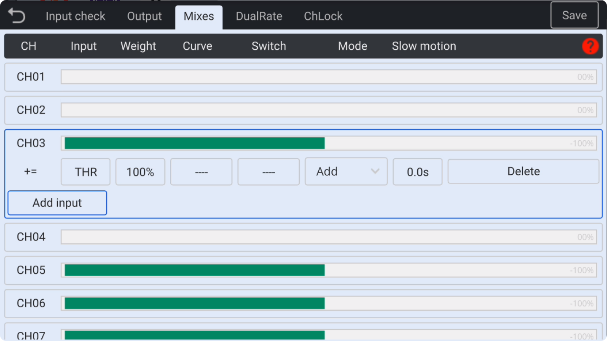
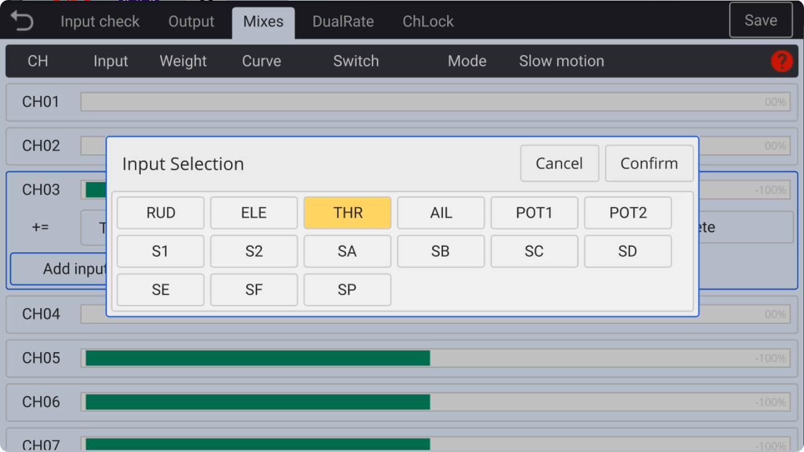
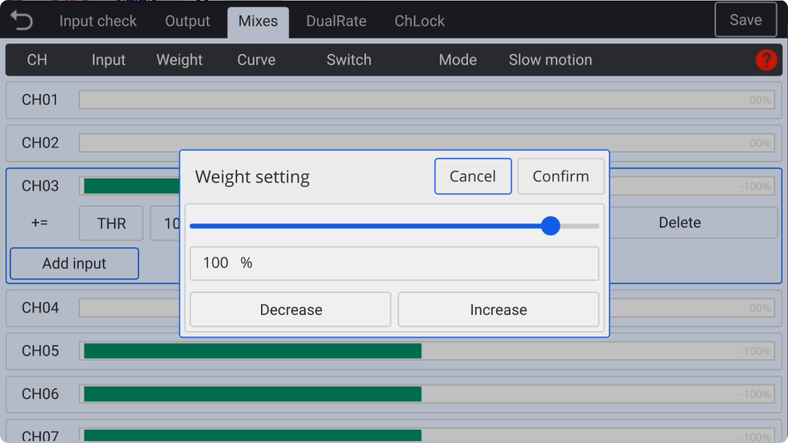
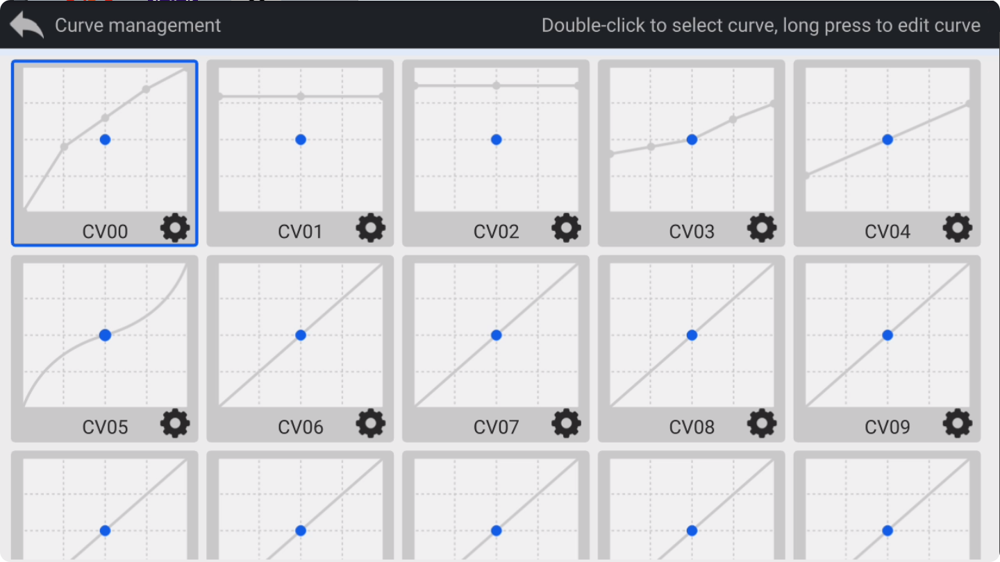
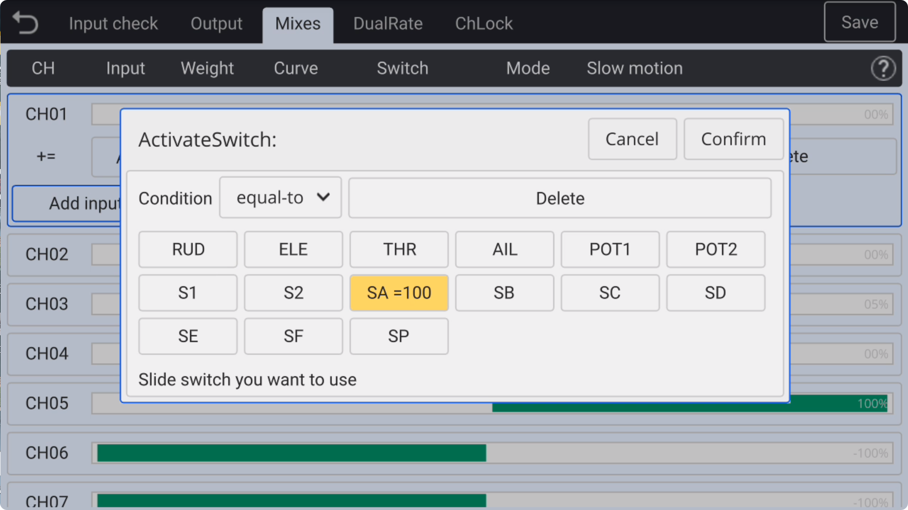
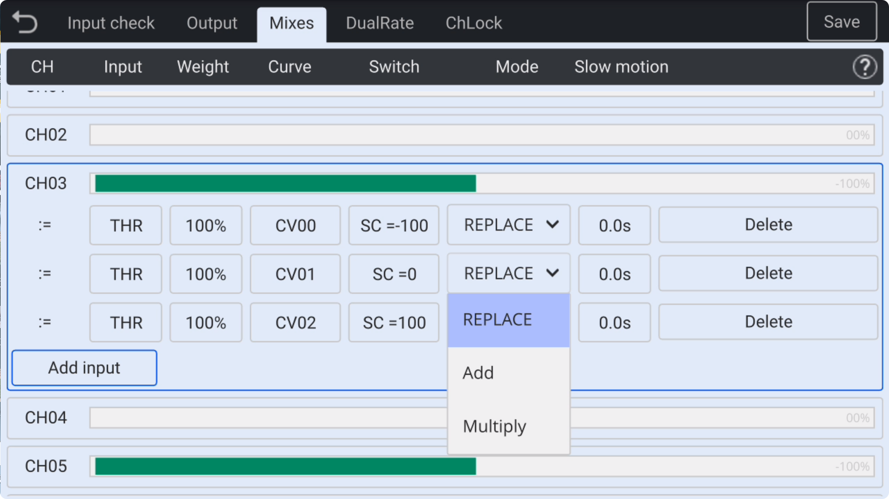
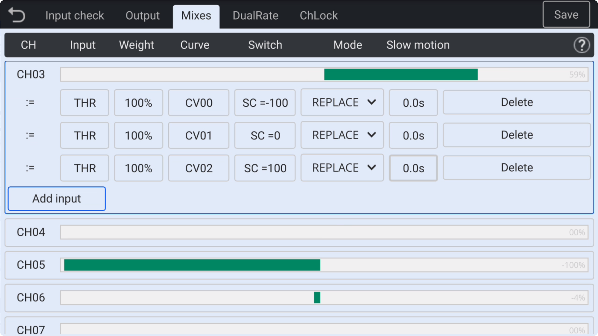
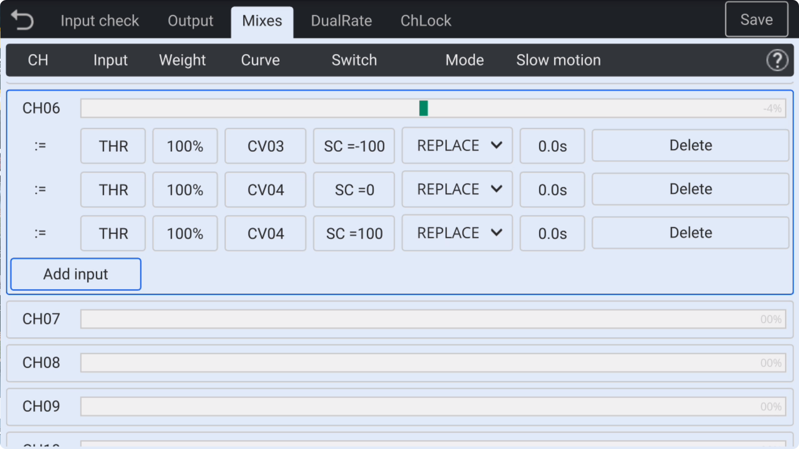
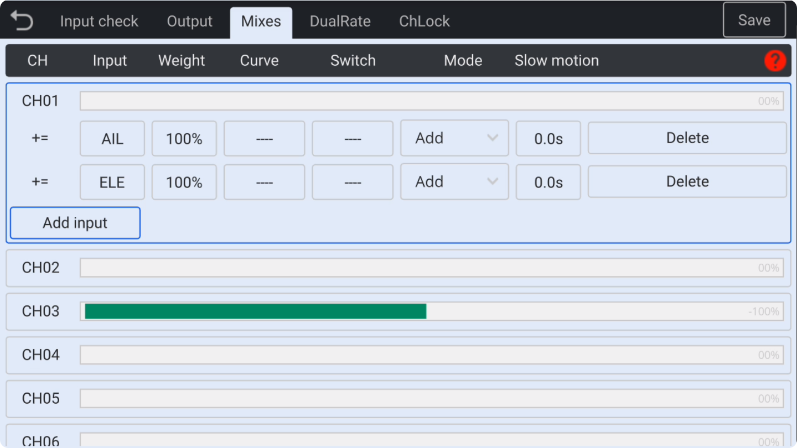
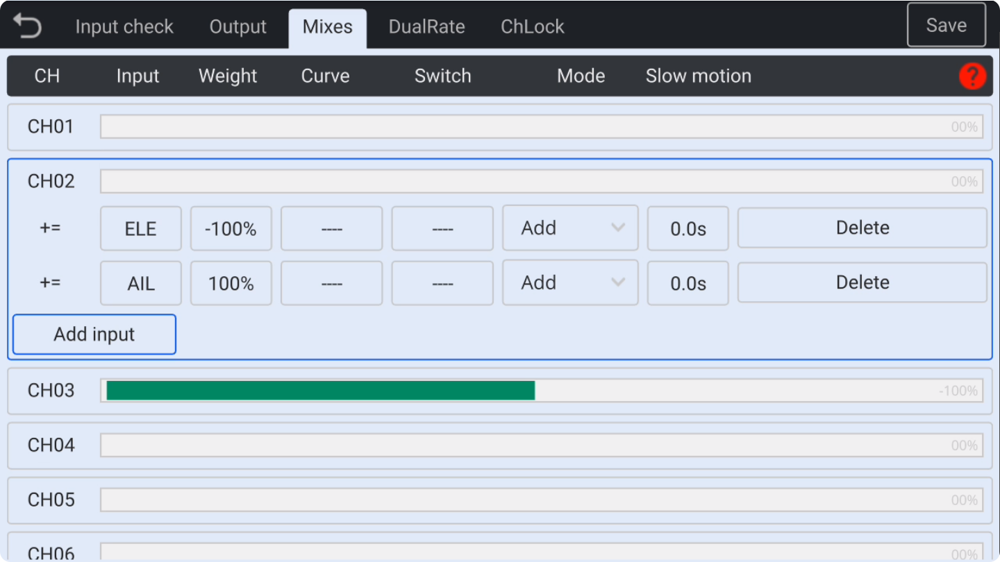

### Mixes

The **Mixer Settings** function is a crucial feature for configuring transmitter channels. Here, you can set up each channel by assigning its **input source** (sticks, knobs, switches), adjusting the **travel**, **curve**, and **activation switch** for each mix, and configuring mixed controls through **addition**, **replacement**, or **multiplication**. You can also use the **slow** function to specify slow-motion timing.

Each channel can have multiple entries with mixed controls, commonly used for setups like delta wings, V-tails, or helicopters, where **a single input controls multiple channels** or **multiple inputs control a single channel**.

**Important Note:** Changes to any setting in an entry will not immediately affect the output. To apply changes instantly, click the **Save icon** in the upper-right corner, and then check the output effect on the aircraft side.

　　

- **CH**: Channel number, **CH01-CH16**
  
  
  
  　　

- **Input**: Select the **input source**, with options including **joystick** (AIL/ELE/THR/RUD), **switch** (SA-SF), **knob** (POT1/S2), and **6-position key** (SP).

　　

- **Weight**: Set the channel **travel** (±0–125%) for the current entry. When a **negative value** is selected, the output channel value for the current entry will be **reversed**.

　　

- **Curve**: Curves can be loaded here, with **17 custom curves** available for use. In the curve settings, preset curve types (such as **DIFF curves**, **EXPO curves**, etc.) can be selected. Curves can be **fully customized**, allowing the setting of **3 to 12-point curves**, with **X/Y coordinate values** freely adjustable for each point on the curve. **Double-tap** to select a curve for the current entry, **long-press** the curve icon or click the **gear icon** to **edit** the curve. If you click back, the loaded curve will be **unloaded** from the current entry.
  
  For a detailed explanation of curve functions, please refer to the **Curve Settings** section.

　　

- **Switch**: The activation switch position of the current entry, which can **activate/disable** the current entry. You can also use other joystick or knob values for comparisons such as **greater than, less than, equal to,** etc., and use them as **trigger conditions**.

　　

- **Mode**: Options include **Add, Replace**, and **Multiply** functions. The travel value of the current entry will undergo **relevant operations** with previous values. Typically, when **switching** functions such as flight modes, the **Replace** mode should be selected.

　　

- **Slow Motion**: The slow motion effect of the channel can be set, with a minimum setting time unit of 0.1 seconds and a maximum time of 5.0 seconds.

- **Delete**: Remove the current entry.
  
  　
  
  　

**Mixing Example**: Switching Between Helicopter **Throttle** and **Collective Pitch** Modes

　　

This screenshot illustrates the three **throttle modes** of a helicopter. The **SC switch** is used to toggle between **Normal Flight Mode**, **IDLE1 3D Mode**, and **IDLE2 3D Mode** on **CH3**, while simultaneously switching the corresponding **throttle curves** for these **three modes**.

　　

This screenshot illustrates three **pitch modes** of a helicopter. The **SC switch** is used to toggle between **Forward Flight Route**, **IDLE1 3D**, and **IDLE2 3D** modes on **CH6**, while simultaneously switching the corresponding **pitch curves** for these **three modes**.

　　

**Mixing Example**: Delta Wing Mixing

　　

This screenshot shows the simultaneous introduction of **AIL** and **ELE** joystick controls in both **CH01** and **CH02**, using a **superposition** method to achieve the mixed linkage control function for **roll** and **pitch** in a **delta wing**.

