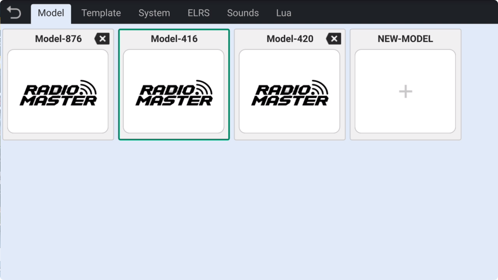
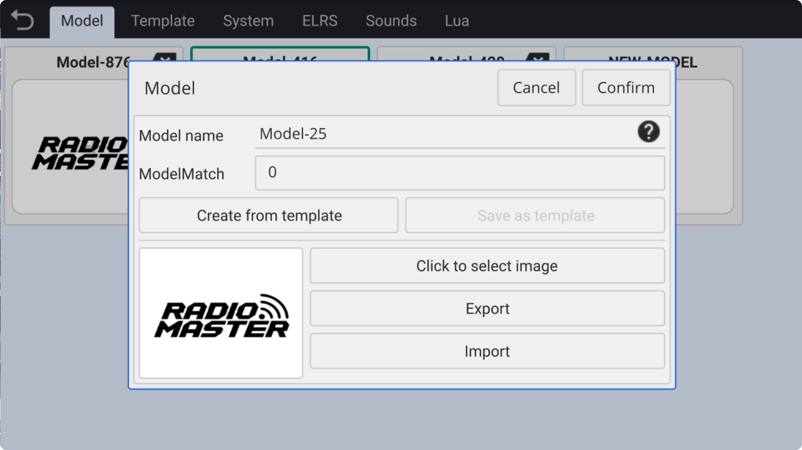

### Model

On the model management page, you can **create** different types of models, **name** them, specify **model images**, save the current model as a **template**, **export** and **import** model data, and **delete** models, among other functions.

　　

- **Create New Model**: Click the blank **"+"** icon to open the new model creation function.

- **Model Name**: **Name** the new model.

- **Model Match:** Set the **Model Match** ID for ELRS.

- **Create from Template**: Choose a custom template to **quickly create** a model identical to the template.

- **Save as Template**: Save the current model as a template for **quick creation** of similar models in the future.

- **Click to Select Image**: Choose an image from the default graphics as the current model’s image, or select any **custom image** from **storage** as the model’s image.

- **Export**: Export the current model to the built-in **Download folder** for **sharing** or **backing up** the model.

- **Import**: **Import** a model from the **Download folder** in storage.

- **Delete Model**: The currently active model cannot be deleted. To delete an inactive model, click the **delete icon** in the upper-right corner.
