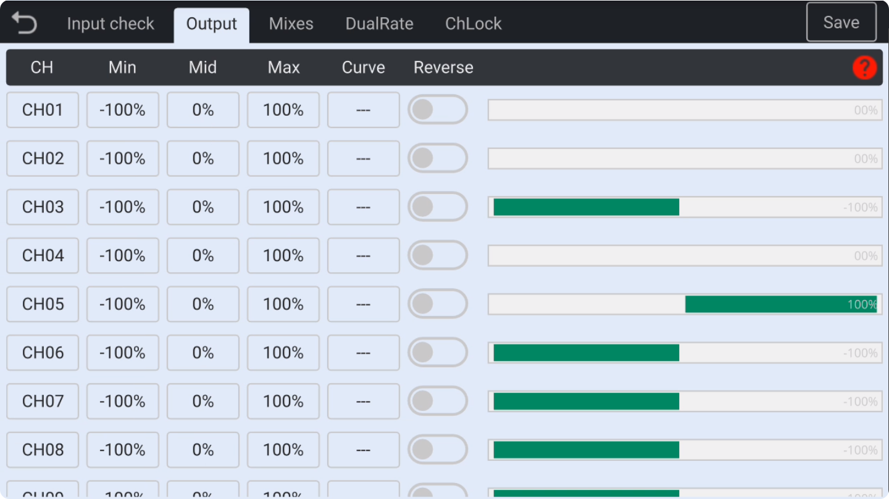

### Output

Here, you can **adjust** the **midpoint offset** value for each channel, as well as the **minimum** and **maximum** values. Additionally, you can **load curves** and **invert** channels.

　　

- **Min/Max**: Channels can be expanded to ±**125%**. Channels can also be reduced to limit servo travel.

- **Mid**: Allows adjustment of the **midpoint** offset value. Unlike temporary trimming, this setting applies a fixed offset to the channel to correct deviations caused by manual installation of control surfaces.

- **Curve**: Here, you can **load curves**, with **17 customizable curves** available. In the curve settings, you can select **preset curve types** (e.g., DIFF curve, EXPO curve, etc.) or fully **customize curves** by freely defining **3 to 12 points**. Each **coordinate point** on the curve can be assigned arbitrary **X/Y values**. **Double-tap** to select a curve for the current entry, and **long-press** the curve icon or tap the gear icon to **edit** the curve. If you tap the back button, the loaded curve will be **removed** from the current entry.
  For detailed instructions on curve functions, please refer to the **Curve Settings** section.

- **Reverse**: Allows you to invert the **direction** of each channel.
