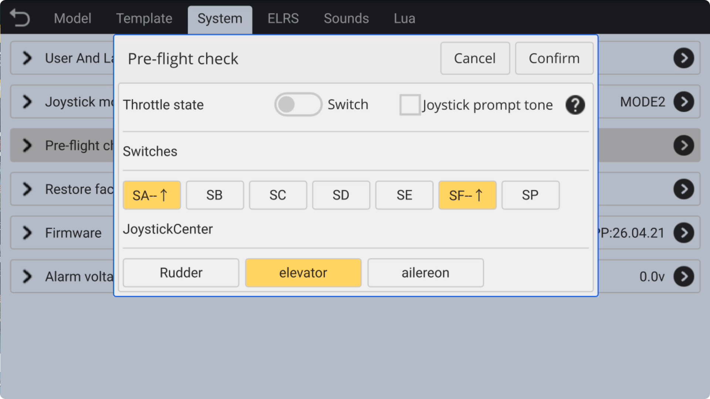

### Power on check

This feature is an independent function for each model, allowing individual **power-on checks** to be configured for each model. It ensures that different models have corresponding checks for **low throttle position**, default **switch positions**, **stick midpoint**, and **stick center tone alerts**.

　　

