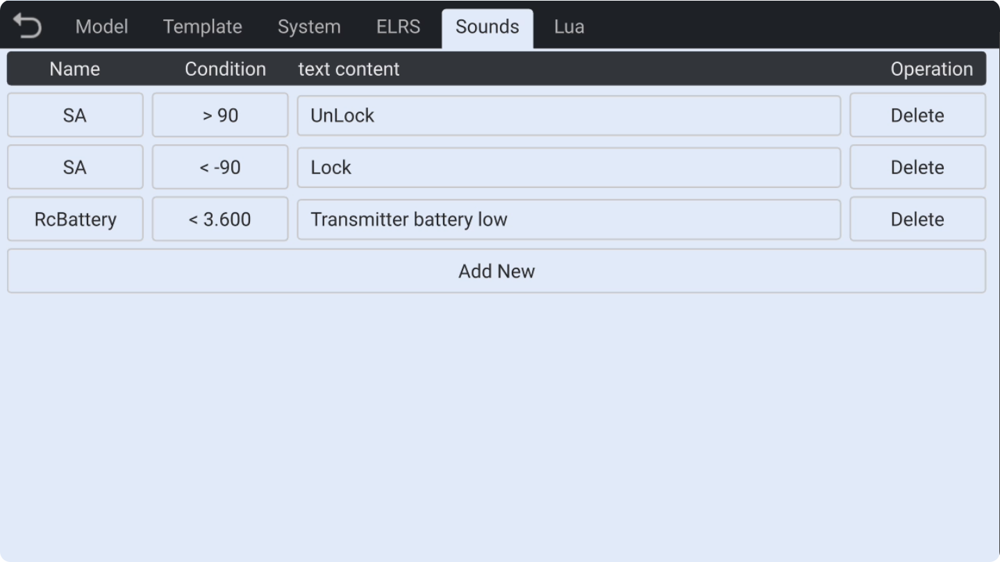
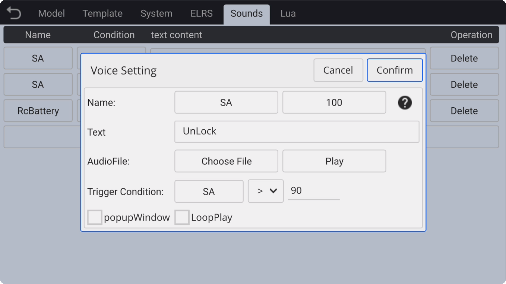
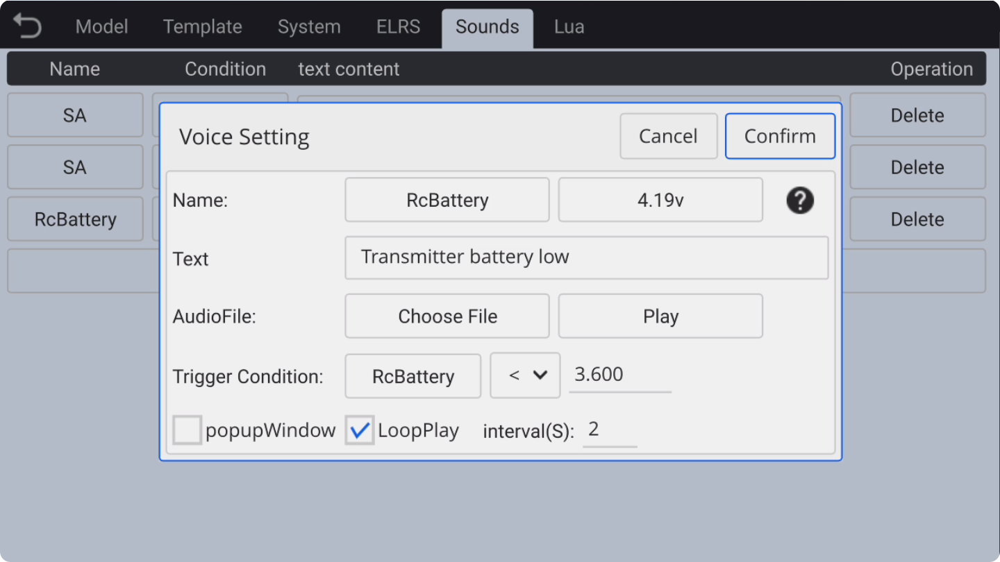
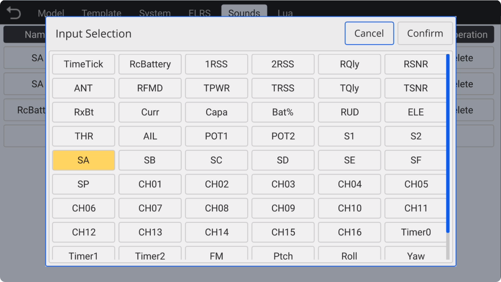

### Sounds

The AX12 offers fully **customizable voice** broadcast functionality. You can use the **text input** method to make the remote control play any text-to-**speech synthesized voice** based on **trigger conditions**, or you can use your own recorded **MP3** audio files.
　　

