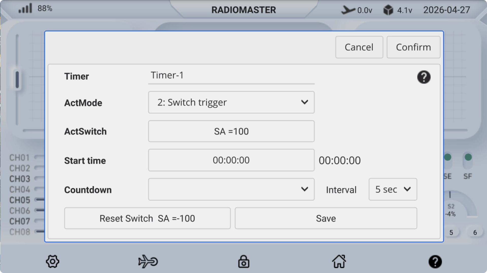
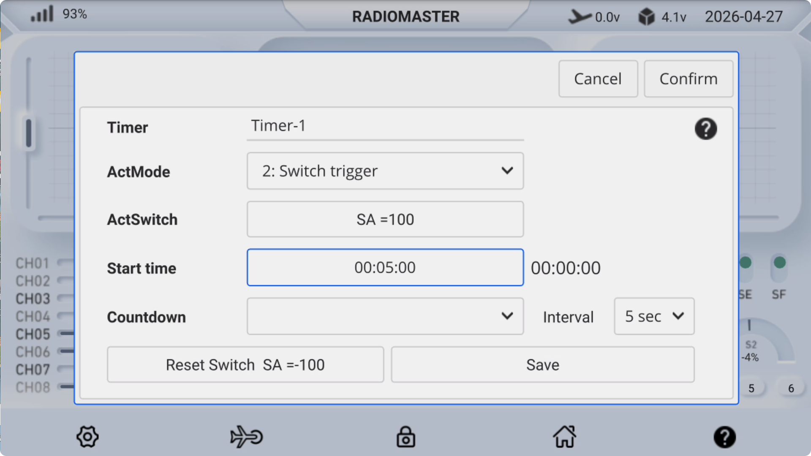

### Timers

**Activation Mode:**

- Off: Timer disabled

- Always On: Timer always active

- Switch Trigger: Timer activated by a specified switch position

- Lower Throttle: Timer triggered when throttle reaches the lowest position

- Throttle Mid  position 0%: Timer triggered when throttle reaches the midpoint

- Raise throttle: Timer activated when throttle is above the lowest position

**Activation Switch:** Set the timer activation switch, e.g., **SA↑**

**Start Time:** When the start time is set to **00:00:00**, it functions as a **count-up timer**. When any other time is set, it will act as a **countdown timer** starting from that time.

**Countdown:** Options include mute, beep, or voice announcement.

**Interval:** Time interval for countdown alerts.

**Reset Switch:** Set the timer reset switch, e.g., **SA↓**

**Save:** After configuration, click **Save** to store the settings, and click **Confirm** to close the settings window.

　　

**Timer setting example:** When the **SA switch is turned on (100)**, the count-up timer starts (initial time is 00:00:00); when the **SA switch is turned off (-100)**, the timer is **reset**.

　　

**Timer setting example:** When the SA switch is **turned on (100)** , it starts a 5-minute countdown (starting at 00:05:00); when the SA switch is **turned off (-100)** , the timer is **reset**.

